## 1.2 Introduction to the Study of Complexity

Aim: find out how simple agents produce complex behavior without central control


## 1.3 Properties Common to Complex Systems

Properties:

+ Simple components or agents(simple relative to the whole system)
+ Nonlinear interactions among components(the whole is more than the sum of the parts)
+ No central control

+ Emergent behaviors(system level, not individual level)

  + hierarchical organization
  + information processing

  + dynamics
  + evolution and learning


## 1.4 Core Disciplines, Goals, and Methodologies of the Sciences of Complexity

Core disciplines

+ Dynamics: The study of continually changing structure and behavior of systems
+ Information: The study of representation, symbols, and communications
+ Computation: The study of how system process information and act on the results
+ Evolution: The study of how systems adapt to constantly


Goals

+ Cross-disciplinary insights into complex systems√
+ General theory?


Methodologies

+ Experimental work
+ Theoretical work
+ Computer simulation


## 1.5 Definitions of Complexity

There are 42 definitions mentioned by Seth Lloyd[1]

A few like:

+ Shannon information

+ Fractal dimension

Interests of science are divided into 3 categories by Warren Weaver[2]

1. Problems of Simplicity: a few variables
2. Problems of Disorganized Complexity: billions or trillions of variables
3. Problems of Organized Complexity: moderate numbers of variables(strong, nonlinear interactions among variables)

> Problems which involve dealing simultaneously with a sizable number of factors which are interrelated into an organic whole.


## 1.6 What are Complex Systems? The Experts Weigh In

Different definition(focus): 

+ Systems don't yield to compact forms of representation or description(不紧耦合)
+ Questions are complex if those questions require a lot of computational resources to solve(In TCS, systems are complex or simple ×)
+ A natural/artificial system as complex(it has a very sophisticated internal causal architecture that stores and processes information)
+ A system that has interactions with nonlinear elements in it
+ Consists of a bunch of entities that may not start with diverse, but end up being diverse
+ A system of many interacting parts where the system is more than just the sum of its parts
+ Have many interacting active components and the interaction between the components have nontrivial or nonlinear interactions
+ Something with a lot of interacting parts where something about the way those parts behave when they interact is qualitatively different than the way behave if you look at them individually
+ Things that are different from simpler, usually physical, systems in that they tend to be heterogeneous, they tend to be made up of parts that are the not same kind of parts
+ Which contains enormous numbers of actors or agents that are interacting in usually a nonlinear kind of fashion


## 1.7 Introduction to NetLogo

[Download Netlogo](http://ccl.northwestern.edu/netlogo/)

[Getting started with Netlogo](http://s3.amazonaws.com/complexityexplorer/IntroToComplexity/NetLogoDocuments/GettingStartedWithNetLogo.pdf)


Setup->go(also stop)

Do experiments!

Ants model(random):

Phase 1

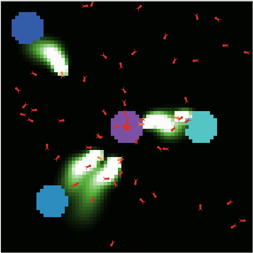

Phase 2

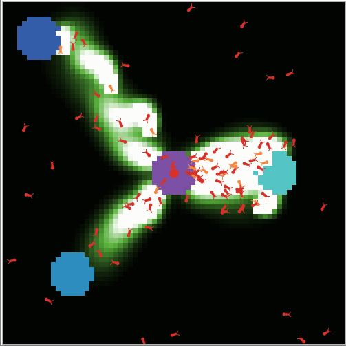

Phase 3

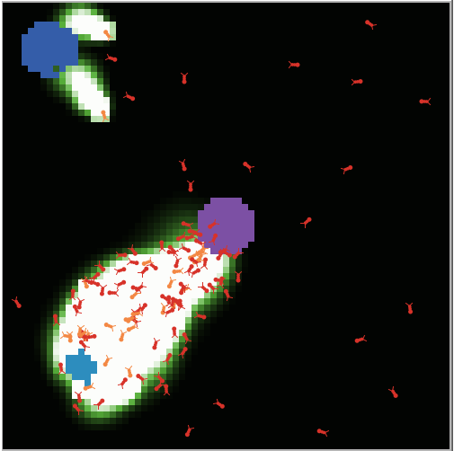

Phase 4

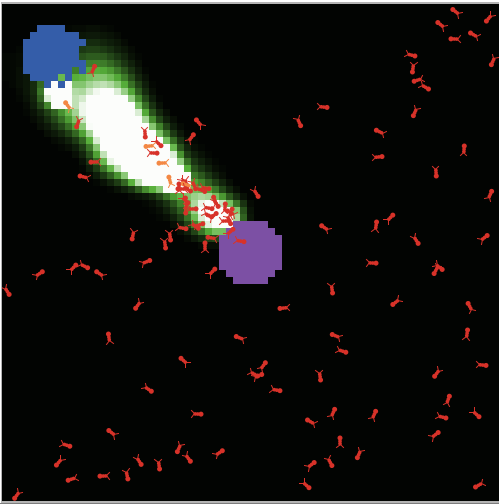

Phase 5

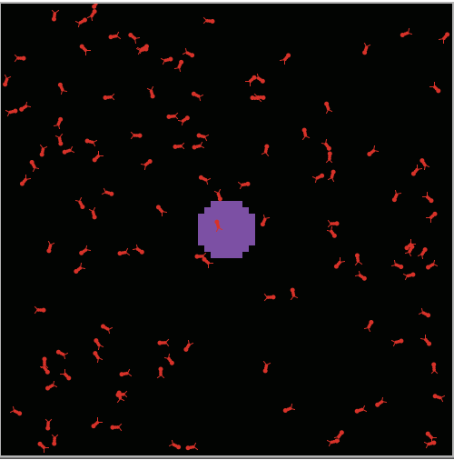


Download [AntsNew.nlogo](https://complexityexplorer.s3.amazonaws.com/IntroToComplexity/Unit1/AntsNew_v_6.1.1.nlogo)


Exercise: 

+ use the materials
+ set population to 200, and diffusion rate to 20
  1. evaporation-rate = 0
  2. evaporation-rate = 5
  3. evaporation-rate = 20


0

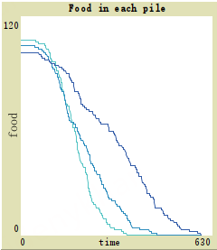

5

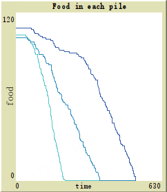


20

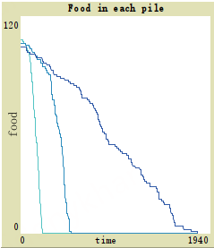


The average time when evaporation-rate = 5 is the fastest


## 1.8 Our First Netlogo Model(Optional Introduction to NetLogo programming)

Download [Ant1.nlogo](https://complexityexplorer.s3.amazonaws.com/IntroToComplexity/Unit1/Ant1_v_6.1.1.nlogo)


agents are called turtles

setup button

```netlogo
to setup
  clear-all
  reset-ticks
  create-turtles 1
  ask turtles
  [
    set shape "bug"
    set size 3
    set color red
  ]
end
```

go button

```netlogo
to go
  ask turtles
  [
    right 30
    forward 4
  ]
  tick
end
```

start

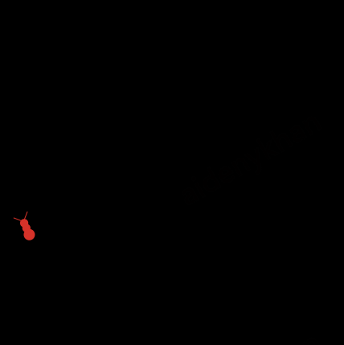

setup infinitively -> in the center, but towards a different place


boring?

```netlogo
to go
  ask turtles
  [
    right random 30
    forward random 4
  ]
  tick
end
```


also, go through the wall

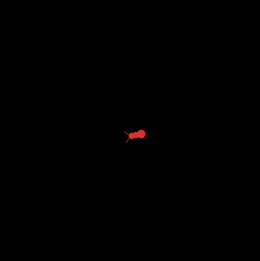


not random?

`report` returns a value

add comments by `;`

```netlogo
to go
  ask turtles
  [
    ifelse coin-flip? [right random 60] [left random 60] ; if coin-flip? is true, turn right else turn left
    forward random 4
  ]
  tick
end

to-report coin-flip?
  report random 2 = 0 ; returns true or false at random
end
```

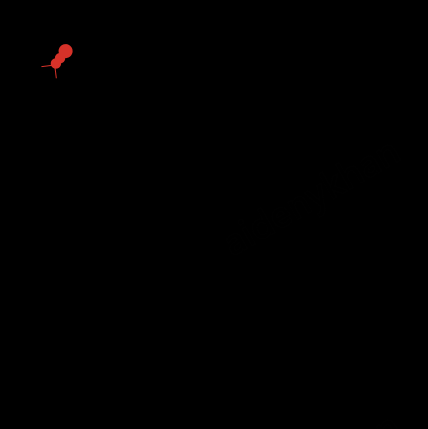


## 1.9 Our Second NetLogo Model(Optional Introduction to NetLogo programming, part 2)

Download [Ant2.nlogo](https://complexityexplorer.s3.amazonaws.com/IntroToComplexity/Unit1/Ant2_v_6.1.1.nlogo)


patches

grow food

```netlogo
to grow-food
  ask patches [set pcolor green] ; grass
end
```


eat

```netlogo
to go
  ask turtles
  [
    ifelse coin-flip? [right random 60][left random 60]  ; if coin-flip? is true, turn right else turn left
    forward random 4
    if pcolor = green ; if the turtle is located on a green patch
    [
      set pcolor black
      set food-eaten (food-eaten + 1)
      set label food-eaten
    ]
  ]
  tick
end
```


turtle stomach(don't digest in this model)

```netlogo
turtles-own [food-eaten]
```


start out as 0

```netlogo
to setup
  clear-all
  reset-ticks
  create-turtles 1
  ask turtles
  [
    set shape "bug"
    set size 3
    set color red
    set food-eaten 0
  ]
  grow-food
end
```


one ant situation(size 1 actually)

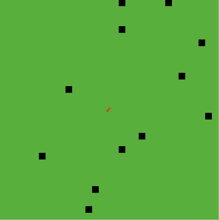


slider usage

population

```netlogo
to setup
  clear-all
  reset-ticks
  create-turtles population
  ask turtles
  [
    set shape "bug"
    set size 1
    set color red
    set food-eaten 0
  ]
  grow-food
end
```


plot usage

total food eaten-time

Pen update commands: `plot sum [food-eaten] of turtles`


step size and turn angle

```netlogo
to go
  if not any? patches with [pcolor = green] [stop]
  ask turtles
  [
    ifelse coin-flip? [right random max-turn-angle][left random max-turn-angle]  ; if coin-flip? is true, turn right else turn left
    forward random max-step-size
    if pcolor = green ; if the turtle is located on a green patch
    [
      set pcolor black
      set food-eaten (food-eaten + 1)
      set label food-eaten
    ]
  ]
  tick
end
```


multiple ones(80, 5, 120)

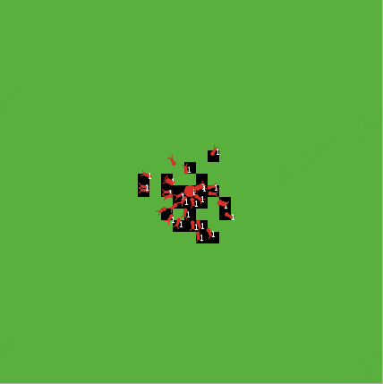


stop exactly

```netlogo
to go
  if not any? patches with [pcolor = green] [stop]
  ask turtles
  [
    ifelse coin-flip? [right random 60][left random 60]  ; if coin-flip? is true, turn right else turn left
    forward random 4
    if pcolor = green ; if the turtle is located on a green patch
    [
      set pcolor black
      set food-eaten (food-eaten + 1)
      set label food-eaten
    ]
  ]
  tick
end
```


## References

- [1] [Measurement of Complexity a non--exhaustive list](https://web.mit.edu/esd.83/www/notebook/Complexity.PDF)

+ [2] [Science and Complexity](https://fernandonogueiracosta.files.wordpress.com/2015/08/warren-weaver-science-and-complexity-1948.pdf)