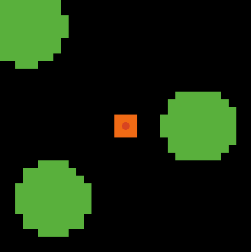
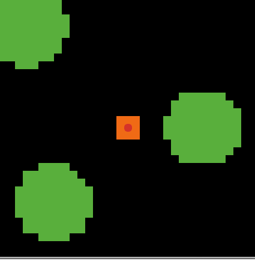

Beginner Option

1. + 50 as the population
     + 5 times: 472, 373, 357, 239, 290
     + Average is 346.2
   + Not exactly by a factor of 2
   + 100 as the population
     + 5 times: 153, 157, 128, 140, 208
     + Average is 157.2
   + Approximately

2. + It depends
   + 5 times: 482, 426, 345, 281, 342
   + Average is 375.2
   + Not necessarily growing or declining

3. + It depends
   + 5 times: 225, 215, 173, 279, 203
   + Average is 219
   + Speed up

4. `set size 1` -> `set size 2`

5. ~~I don't know~~  remove or comment`set label food-eaten`

6. ```netlogo
   to go
     if not any? patches with [pcolor = green] [stop]
     ask turtles
     [
       ifelse coin-flip? [right random max-turn-angle][left random max-turn-angle]  ; if coin-flip? is true, turn right else turn left
       forward random max-step-size
       if pcolor = green ; if the turtle is located on a green patch
       [
         set pcolor black
         set food-eaten (food-eaten + 1)
         ; set label food-eaten
       ]
       if (food-eaten > 2) [set color blue]
       if (food-eaten > 4) [set color yellow]
     ]
   
     tick
   end
   ```


Intermediate Option

similar to functional programming in Python

```netlogo
turtles-own [food-eaten return-to-nest?]

patches-own [nest?]

to setup
  clear-all
  reset-ticks
  create-turtles population

  ask turtles
  [
    set return-to-nest? false ; flag
    set shape "bug"
    set size 1
    set color red
    set food-eaten 0
  ]
  grow-food
  set-up-nest
end

to set-up-nest
  ask patches[
    set nest? (distancexy 0 0) < 2
    if nest? [set pcolor orange]
  ]
end

to go
  if not any? patches with [pcolor = green] [stop]
  ask turtles
  [ ifelse return-to-nest? = false
    [look-for-food]
    [return-to-nest]
  ]

  tick
end

to return-to-nest
  face patch 0 0 fd 1
  if pcolor = orange
  [set return-to-nest? false]
end

to look-for-food
    ifelse coin-flip? [right random max-turn-angle][left random max-turn-angle]  ; if coin-flip? is true, turn right else turn left
    forward random max-step-size
    if pcolor = green ; if the turtle is located on a green patch
    [
      set pcolor black
      set food-eaten (food-eaten + 1)
      set label food-eaten
      set return-to-nest? true
    ]
end
```


Advanced Option

1. Set plabel for pheromone

```netlogo
patches-own [nest? pheromone]

to setup
  clear-all
  reset-ticks
  create-turtles population

  ask turtles
  [
    set return-to-nest? false ; flag
    set shape "bug"
    set size 1
    set color red
    set food-eaten 0
  ]
  grow-food
  set-up-patches
end

to set-up-patches
  ask patches[
    set pheromone 0
    set nest? (distancexy 0 0) < 2
    if nest? [set pcolor orange]
  ]
end

to return-to-nest
  face patch 0 0 fd 1
  set pheromone pheromone + 1
  set plabel pheromone 
  if pcolor = orange
  [set return-to-nest? false]
end
```



2. Let pheromone evaporate

```netlogo
to go
  if not any? patches with [pcolor = green] [stop]
  ask turtles
  [ ifelse return-to-nest? = false
    [look-for-food]
    [return-to-nest]
  ]
  evaporate-pheromone
  tick
end

to evaporate-pheromone
  let x random-float 1
  ask patches with [pheromone > 0]
  [if x < probability-to-evaporate
    [set pheromone pheromone - 1]
    set plabel pheromone]
end
```


3. Follow the pheromone

```netlogo
turtles-own [food-eaten return-to-nest?]

patches-own [nest? pheromone]

to setup
  clear-all
  reset-ticks
  create-turtles population

  ask turtles
  [
    set return-to-nest? false ; flag
    set shape "bug"
    set size 1
    set color red
    set food-eaten 0
  ]
  grow-food
  set-up-patches
end

to set-up-patches
  ask patches[
    set pheromone 0
    set nest? (distancexy 0 0) < 2
    if nest? [set pcolor orange]
  ]
end

to go
  if not any? patches with [pcolor = green] [stop]
  ask turtles
  [ ifelse return-to-nest? = false
    [look-for-food]
    [return-to-nest]
  ]
  evaporate-pheromone
  tick
end

to return-to-nest
  face patch 0 0 fd 1
  set pheromone pheromone + 1
  set plabel pheromone 
  if pcolor = orange
  [set return-to-nest? false]
end

to look-for-food
  let pheromone-ahead? scent-at-angle 0
  let pheromone-right? scent-at-angle 45
  let pheromone-left? scent-at-angle 45 ; selected range
  
  ifelse (pheromone-right? > pheromone-ahead? or pheromone-left? > pheromone-ahead?)
  [ifelse pheromone-right? > pheromone-left?
    [rt 45]
    [lt 45]]
  
    [if pheromone-ahead? = 0
    [ifelse coin-flip? [right random max-turn-angle][left random max-turn-angle]]  ; if coin-flip? is true, turn right else turn left
    forward random max-step-size
    if pcolor = green ; if the turtle is located on a green patch
    [
      set pcolor black
      set food-eaten (food-eaten + 1)
      set label food-eaten
      set return-to-nest? true
    ]
  ]
end

to-report coin-flip?     ; returns true or false at random
  report random 2 = 0
end

to grow-food
  ;; patch procedure
  ;; setup food source one on the right
  ask patches [if (distancexy (0.6 * max-pxcor) 0) < 5
  [ set pcolor green ]
  ;; setup food source two on the lower-left
  if (distancexy (-0.6 * max-pxcor) (-0.6 * max-pycor)) < 5
  [ set pcolor green ]
  ;; setup food source three on the upper-left
  if (distancexy (-0.8 * max-pxcor) (0.8 * max-pycor)) < 5
  [ set pcolor green ]
  ]
end

to evaporate-pheromone
  let x random-float 1
  ask patches with [pheromone > 0]
  [if x < probability-to-evaporate
    [set pheromone pheromone - 1]
    set plabel pheromone]
end
; to, similar to def

to-report scent-at-angle [angle]
  let p patch-right-and-ahead angle 1
  if p = nobody [report 0]
  report [pheromone] of p
end
; usage: find the required signle patch that is the given distance from this turtle
; to-report, return numerical data, similar to int, float, double, etc.
; [pheromone] of p is similar to p.pheromone
```


