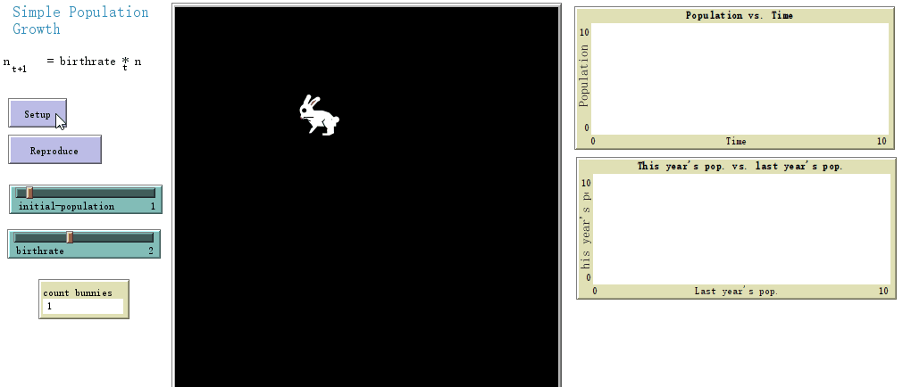
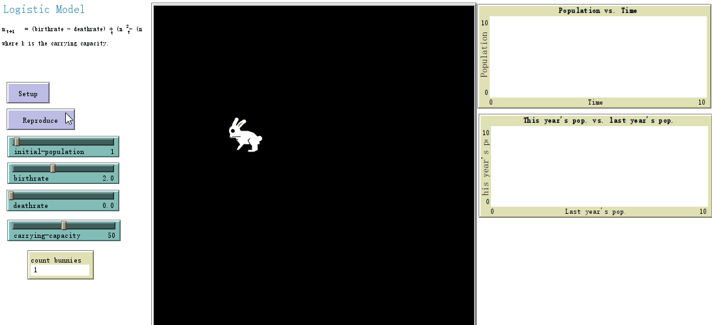
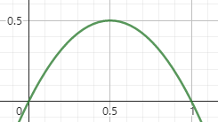

## 2.2 Introduction to Dynamics

Dynamics

+ Definition

  + how their complex behaviors unfold

  + how things change over time

+ Different types
  + planetary dynamics
  + fluid dynamics
  + electrical dynamics
  + climate dynamics
  + crowd dynamics
  + population dynamics
  + financial dynamics
  + group dynamics
  + social dynamics
+ Dynamical systems theory
  + the branch of math
  + gives us a vocabulary and set of mathematical tools for describing dynamics
+ Brief history
  + Aristotle
  + Nicolaus Copernieus
  + Galileo Galilei
  + Isaac Newton(the founder of the modern science of dynamics)
  + Pierre-Simon Laplace(intellect[1])
  + Henri Poincaré(some system -> butterfly effect)

Chaos

+ One particular type of dynamics of a system
+ Defined as "sensitive dependence on initial condition"
+ Chaos in the nature
  + dripping faucets
  + electrical circuits
  + solar system orbits
  + weather and climate
  + brain activity(EEG)
  + heart activity(EKG)
  + computer networks
  + population growth and dynamics
  + financial data
+ Difference between chaos and randomness?
+ Notion of "deterministic chaos"

## 2.3 Iteration

Download [SimplePopulationGrowth.nlogo](https://complexityexplorer.s3.amazonaws.com/IntroToComplexity/Unit2/SimplePopulationGrowth_v_6.1.1.nlogo)

an example is population growth

set n as the population, which follows an exponential function
$$
n_{t}=birthrate^t
$$
linear system(no interactions among bunnies)
$$
n_{t+1}=birthrate*n_t
$$

Question 1: n4 = 81

## 2.4 Linear versus Nonlinear Systems

Download [LogisticModel.nlogo](https://complexityexplorer.s3.amazonaws.com/IntroToComplexity/Unit2/LogisticModel_v_6.1.1.nlogo)

linearity: the whole is the sum of the parts

example: 10 different runs of the initial population at 1 = an initial population at 10

a number of bunnies die due to overcrowding -> nonlinear interaction

Logistic Model(By Verhulst)
$$
n_{t+1}=(birthrate-deathrate)*[n_t-\frac{n_t^2}{maxpopulation}]
$$
number will be rounded off(real number)

stick at 25

why not reach capacity? $(25-625/50)*2=25$

whole is different from the sum of the parts

Exercise 1: 30

Exercise 2: Same

Exercise 3: Yes

## 2.5 Logistic Map

Logistic Model:

set $k$ as max-population, $x_t=\frac{n_t}{k}$, then we can get the logistic map
$$
x_{t+1}=R[x_t-x_t^2]
$$
$x^t \in (0,1)$ maps to a new value $x_{t+1} \in (0,1)$

Example:

set $R=2$ and $x_0=0.2$, then$x_6 \approx 0.5$ and $x_7 \approx 0.5$

0.5 is called **attractor**

Since $n_0$ can change, 0.5 is called **fixed point attractor**

dynamic sense: $(x_{t-1}, x_t} -> $(x_t, x_{t+1}) will always move to/stay on the left, and move towards the center

Quiz: 0.6

## References

- [1] [A philosophical essay on probabilities](https://bayes.wustl.edu/Manual/laplace_A_philosophical_essay_on_probabilities.pdf)

