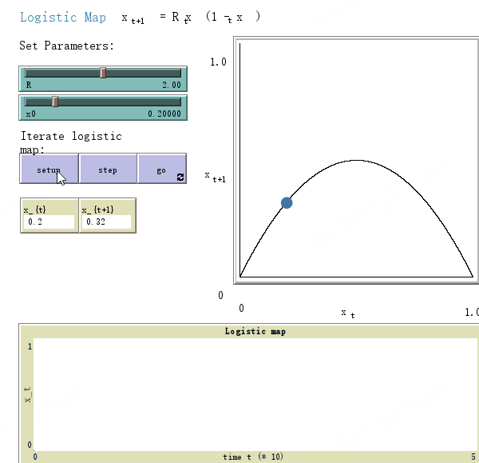
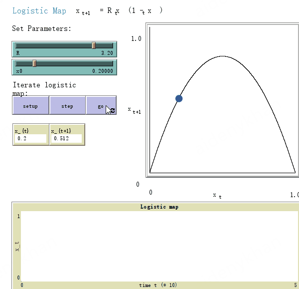
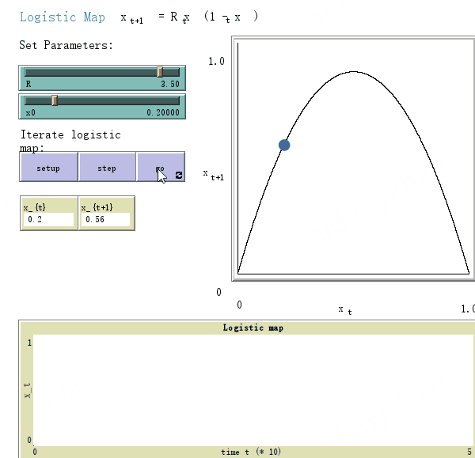
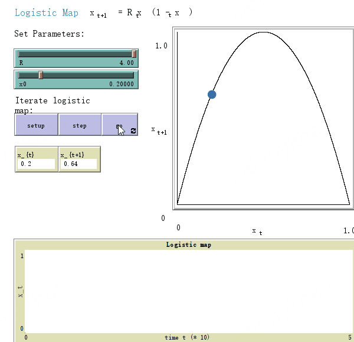
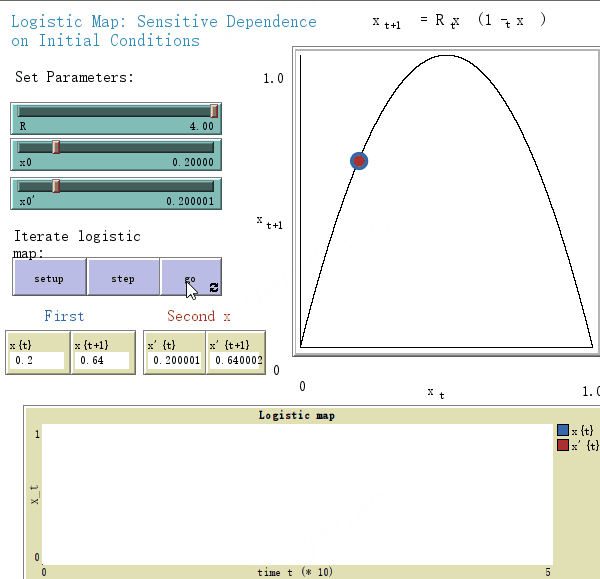
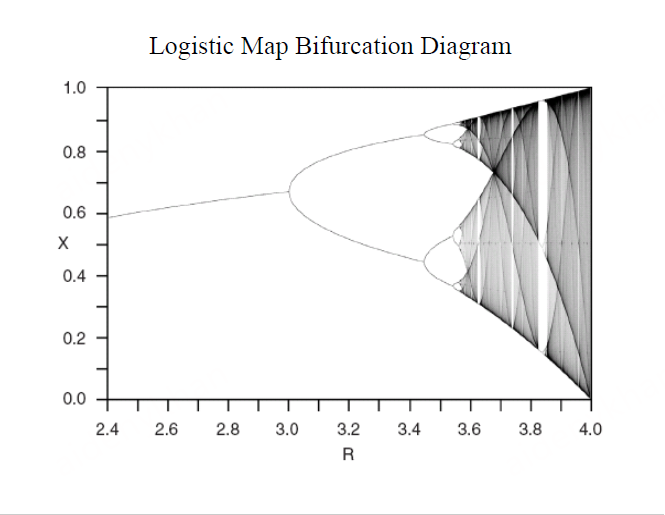
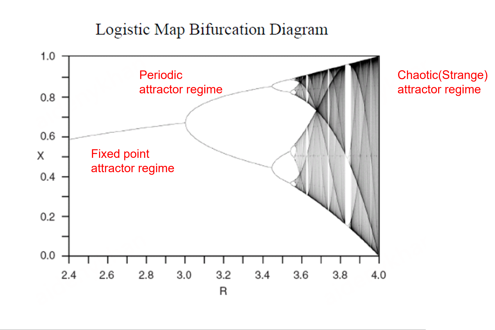
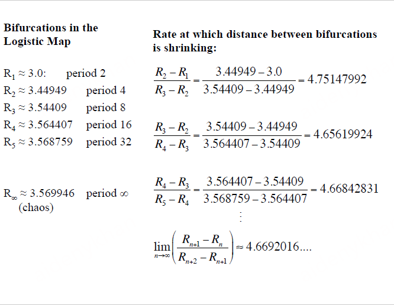

## 2.2 Introduction to Dynamics

Dynamics

+ Definition

  + how their complex behaviors unfold

  + how things change over time

+ Different types
  + planetary dynamics
  + fluid dynamics
  + electrical dynamics
  + climate dynamics
  + crowd dynamics
  + population dynamics
  + financial dynamics
  + group dynamics
  + social dynamics
+ Dynamical systems theory
  + the branch of math
  + gives us a vocabulary and set of mathematical tools for describing dynamics
+ Brief history
  + Aristotle
  + Nicolaus Copernieus
  + Galileo Galilei
  + Isaac Newton(the founder of the modern science of dynamics)
  + Pierre-Simon Laplace(intellect[1])
  + Henri Poincaré(some system -> butterfly effect)

Chaos

+ One particular type of dynamics of a system
+ Defined as "sensitive dependence on initial condition"
+ Chaos in the nature
  + dripping faucets
  + electrical circuits
  + solar system orbits
  + weather and climate
  + brain activity(EEG)
  + heart activity(EKG)
  + computer networks
  + population growth and dynamics
  + financial data
+ Difference between chaos and randomness?
+ Notion of "deterministic chaos"

## 2.3 Iteration

Download [SimplePopulationGrowth.nlogo](https://complexityexplorer.s3.amazonaws.com/IntroToComplexity/Unit2/SimplePopulationGrowth_v_6.1.1.nlogo)

an example is population growth

set n as the population, which follows an exponential function
$$n_{t}=birthrate^t$$
linear system(no interactions among bunnies)
$$n_{t+1}=birthrate*n_t$$

Question 1: n4 = 81

## 2.4 Linear versus Nonlinear Systems

Download [LogisticModel.nlogo](https://complexityexplorer.s3.amazonaws.com/IntroToComplexity/Unit2/LogisticModel_v_6.1.1.nlogo)

linearity: the whole is the sum of the parts

example: 10 different runs of the initial population at 1 = an initial population at 10

a number of bunnies die due to overcrowding -> nonlinear interaction

Logistic Model(By Verhulst)
$$n_{t+1}=(birthrate-deathrate)*[n_t-\frac{n_t^2}{maxpopulation}]$$
number will be rounded off(real number)

stick at 25

why not reach capacity? $(25-625/50)*2=25$

whole is different from the sum of the parts

Exercise 1: 30

Exercise 2: Same

Exercise 3: Yes

## 2.5 Logistic Map

Logistic Model:

set $k$ as max-population, $x_t=\frac{n_t}{k}$, then we can get the logistic map
$$x_{t+1}=R[x_t-x_t^2]$$
$x^t \in (0,1)$ maps to a new value $x_{t+1} \in (0,1)$

Example:

set $R=2$ and $x_0=0.2$, then $x_6 \approx 0.5$ and $x_7 \approx 0.5$

0.5 is called **attractor**

Since $n_0$ can change, 0.5 is called **fixed point attractor**

dynamic sense: $(x_{t-1}, x_t) -> (x_t, x_{t+1})$ will always move to/stay on the left, and move towards the center

Quiz: 0.6

## 2.6 Period Doubling Routes to Chaos

Download [LogisticMap.nlogo](https://complexityexplorer.s3.amazonaws.com/IntroToComplexity/Unit2/LogisticMap_v_6.1.1.nlogo)

Sample

$R$ determines the ultimate dynamics of the system

changing $R$ -> time it takes to settle down varies

when $R$ continuously rises, you can find an oscillation between 2 different values

periodic attractor of period 2

**state**: $(x_t, x_{t+1})$ (a point on the graph)

4 values(only doubles)

chaos(quite random, doesn't settle down)

Download [SensitiveDependence.nlogo](https://complexityexplorer.s3.amazonaws.com/IntroToComplexity/Unit2/SensitiveDependence_v_6.1.1.nlogo)

chaos means sensitive dependence on initial conditions

even if we start out with very similar initial conditions, the behavior of these two different systems will look very different after some number of time steps

if we don't know about those decimal places, then prediction becomes impossible [2] [3]

$X$ as an attractor and corresponding $R$, only $2^n$ periods

when $R$ is above 3.55, the dynamics stop being periodic and become chaotic, this value of $R$ is called the onset of chaos

## Universality in Chaos

Download [SineMap.nlogo](http://complexityexplorer.s3.amazonaws.com/IntroToComplexity/Unit2/SineMap_v_6.1.1.nlogo)

Chaos: Seemingly random behavior with *sensitive dependence on initial conditions*

Logistic Map: A simple, completely deterministic equation that, when iterated, can display chaos(depending on the value of $R$)

Deterministic Chaos: Perfect prediction, *a la* Laplace's deterministic "clockwork universe", is impossible, even in principle, if we're looking at a chaotic system

appears with quantum mechanics

the unimodal or one-humped maps

Sine Map

$$x_{t+1}=\frac{R}{4}sin(\pi x_t)$$

set $\lambda=\frac{R}{4}$

Feigenbaum's constant

universal properties(order in chaos):

+ periodic doubling route to chaos

+ follows Feigenbaum-Coullet-Tresser theory

## 2.8 Guest Spot: Liz Bradley, University of Colorado and SFI

Optional readings:

J. Garland and L. Bradley, [On the importance of nonlinear modeling in computer performance prediction](http://arxiv.org/abs/1305.4924)

Q: An example of how you've used tools from nonlinear dynamics and chaos

A: 

+ A computer is a nonlinear dynamical and chaotic system(a whole bunch of transistors and other kinds of things), there are electrons moving around through metal and silicon. It started about 10 years ago when the system got to be so complicated or complex.
+ Use linear time-invariant tools -> Not fully accepted(the system is not amenable to that kind of analysis, much more complicated)
+ Memory usage(for instance) is chaotic: sensitive to initial conditions(run the program twice and watch a time series of memory -> very different)
+ State Variable of a computer registers (browser + other stuff/application for watching lectures)
+ **Experimental data but no proof**: measured the [Lyapunov exponent](https://en.wikipedia.org/wiki/Lyapunov_exponent) and calculated from time series data, then due diligence
+ The cause of bifurcations is the code(application), maybe one program is periodic and another is chaotic(change is not smooth as changing $R$, maybe discrete?)

Q: Exciting current directions for the field of dynamics(open questions)

A: Understanding the formation and role of what is called the Lagrangian coherent structures[4]

+ A crowd at a railway station, some people will be arriving and some will be leaving, the result is chaos but there are structures
+ A shifting pattern of borders between groups of people and people with different goals, borders are called LCS
+ They are intangible, immaterial, and will be undetectable if the passengers stopped moving, but real enough to be treated mathematically
+ Sample: morning glory cloud

Q: Complex System

A:

+ Setup: a system with lots of state variables and they're coupled(often nonlinearly, sometimes adaptively, the way they're coupled changes over time)
+ The behavior of such a thing only occupies a subset of the state place(bird flocking -> some dimension/information that's gone, which are packed together)

## References

- [1] [A philosophical essay on probabilities](https://bayes.wustl.edu/Manual/laplace_A_philosophical_essay_on_probabilities.pdf)
- [2] [Chaos](http://astro1.panet.utoledo.edu/~khare/teaching/PHYS-1190-Fall-2006/chaos-class1.pdf)
- [3] [Simple mathematical models with very complicated dynamics](https://www.researchgate.net/publication/237005499_Simple_Mathematical_Models_With_Very_Complicated_Dynamics/link/541814960cf2218008bf23d2/download)
- [4] [Lagrangian Coherent Structures](http://georgehaller.com/reprints/annurev-fluid-010313-141322.pdf)

